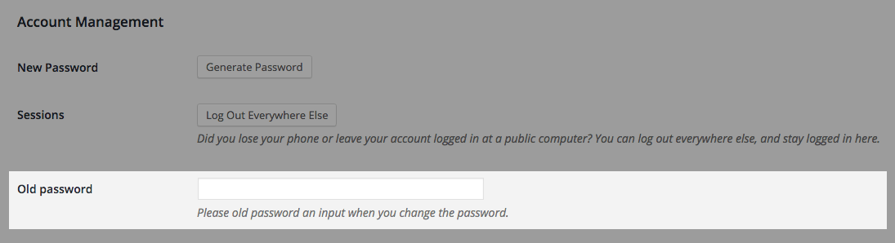

VA Check Old Password
==============================

This is a WordPress plugin that confirm old password before changing to new password.

## Contribute!
You can fork the plugin from [GitHub](https://github.com/kuck1u/va-check-old-password)

## Installation

To install VA Check Old Password:

1. Upload the "va-check-old-password" directory and all its contents to your `/wp-content/plugins/` directory.
2. Activate the plugin through the 'Plugins' menu in WordPress.

## Screenshots

  
**1. Profile edit page.**

## Changelog

### 1.0.0
* First public release.
